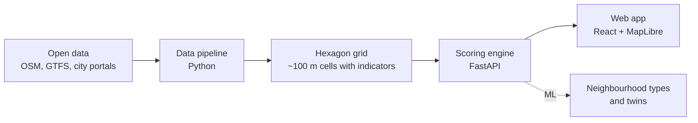

# Kompas · Kraków + Praha

**Find the part of the city that fits your life.**
*Znajdź miejsce w mieście, które pasuje do Twojego życia. · Najděte místo ve městě, které sedí vašemu životu.*

Kompas is a free web app that helps people choose **where to live in Kraków or Prague**. Tell it who you are and what matters to you. It colours the whole city by how well each area fits you, ranks the best neighbourhoods and explains **why** each one fits, with real numbers.

---

## The problem

Moving to a new city, or just to a new flat, means piecing together information from a dozen places: transport timetables, noise maps, air-quality stations, school registers, price maps, crime statistics. It is scattered across different websites, often only in the local language. Nobody tells you which neighbourhoods match **your** priorities.

A student, a young family, a pregnant woman and a senior all need very different things from the same street.

## What Kompas does

1. **Pick a city:** Kraków or Praha.
2. **Pick who you are:** 🎒 Student, 💼 Working, 👨‍👩‍👧 Parent, 🤰 Expecting, 🧓 Senior, 🧳 Relocating (finds a look-alike of your current neighbourhood in the other city), or ✏️ Custom.
3. **Rate what matters with emoji:** 13 topics, each from 😐 "barely matters" to 🤩 "essential":

   | | | | |
   |---|---|---|---|
   | 🧭 Commute to my places | 🚋 Public transport | 🚲 Cycling & walking | 🌳 Green space |
   | 🎓 Education | 🧸 Family & kids | 🛡️ Safety | 💰 Affordability |
   | 🛒 Shops & services | 🏥 Health | 🌬️ Quiet & clean air | 🎭 Culture, sport & food |
   | ♿ Accessibility | | | |

4. **Optionally add your places** (work, university, a child's school) and limits such as a budget, a maximum commute, or "a park within 10 minutes' walk".
5. **See the results:**
   - a **map** of the city made of small hexagons, each coloured by its **match %**
   - a **ranking** of the best places, each with a plain-language "why", for example *"Tram 3 min walk, 38 departures/h"* or *"Noise ~62 dB"*
   - a **detail view** per place: a radar chart against the city average, nearest shops, schools and doctors, commute times, and **how many m² your budget buys there**
   - a **commute map** showing how long it takes to reach your work or school from anywhere
   - **Twin neighbourhoods:** *"You like Kazimierz in Kraków? In Prague, look at Karlín."* Kompas finds places in the other city that feel similar day to day.

You get your first ranking in about three clicks.

## Why it is different

- **Personal, not generic.** Most "best neighbourhood" lists are the same for everyone. Kompas ranks for *your* priorities.
- **Explainable.** Every score breaks down into real values from open data, with the source and date. Missing data is labelled, never invented.
- **Two cities, two countries, four languages.** The UI works fully in Polish, Czech, English and Korean with either city, which helps anyone moving between Kraków and Prague.
- **Private by design.** No login, no cookies, no tracking. Your choices live only in the page link, which you can share.
- **Reusable.** Any city with OpenStreetMap data and public-transport timetables (GTFS) can be added with a config file and a few data adapters.

## How it works



1. **Data pipeline.** Downloads open data for both cities and splits each city into hexagons of about 0.1 km² ([H3](https://h3geo.org/), resolution 9). For every hexagon it measures things like walking minutes to the nearest tram stop, departures per hour, share of greenery, noise in dB, air pollution, and the local price per m².
2. **Scoring engine.** Turns each measurement into a 0–100 score **compared within the same city**, then combines them using your emoji weights (😐 1 · 🙂 2 · 😊 3 · 😍 5 · 🤩 8). Hard limits remove places instead of lowering their score. Travel times are pre-computed on the real transport network for a weekday morning.
3. **Machine learning.**
   - **Neighbourhood types:** clusters both cities together into types such as *Historic heart*, *Student buzz* or *Green residential*; a small neural network then gives each place a type with a probability. The types come from unsupervised clustering, so they are indicative only.
   - **Twin neighbourhoods:** the most similar places in the other city, using only measurements that compare across countries (walking minutes, departures, counts, green share; not noise, air quality or prices, which each country measures differently).
4. **Web app.** Shows it all on an interactive map. It works on phones and laptops.

## Data sources

Every number in the app traces back to one of these open sources. The in-app **"About the data"** page shows the status and fetch date of each one.

### Both cities

| Source | What we use it for | Licence |
|---|---|---|
| [OpenStreetMap](https://www.openstreetmap.org/copyright) (extracts via [Geofabrik](https://download.geofabrik.de/)) | streets, shops, parks, schools, doctors, cycle paths, walking network | ODbL |
| [OpenFreeMap](https://openfreemap.org/) | background map tiles | free, OSM-based |
| [Photon](https://photon.komoot.io/) | address search fallback | OSM-based |

### Kraków 🇵🇱

| Source | What we use it for |
|---|---|
| [ZTP Kraków – GTFS](https://gtfs.ztp.krakow.pl/) | tram and bus timetables, stops, travel times |
| [ZTP Kraków data hub](https://ztpk-gmk-2.hub.arcgis.com/) | bike racks, mobility points |
| [Otwarte Dane Kraków](https://otwartedane.um.krakow.pl/) | city parks, nurseries |
| [MSIP / UM Kraków](https://msip.krakow.pl/228340,artykul,katalog-danych.html) | districts, address points, noise maps |
| [GIOŚ – air quality API](https://powietrze.gios.gov.pl/) | air pollution and live air quality |
| [MEN – register of schools (SIO)](https://dane.gov.pl/pl/dataset/839) | schools and kindergartens (CC BY 4.0) |
| [GUGiK – real-estate price register (RCN)](https://www.geoportal.gov.pl/) | apartment sale prices per m² |
| [Bezpieczny Kraków](https://bezpiecznykrakow-gmk.hub.arcgis.com/) | registered incidents per district |

### Praha 🇨🇿

| Source | What we use it for |
|---|---|
| [PID / ROPID – GTFS](https://pid.cz/en/opendata/) | metro, tram, bus and train timetables (CC BY) |
| [Golemio / OICT](https://api.golemio.cz/) | Prague data platform: playgrounds, gardens, live data |
| [IPR Praha – Geoportál](https://geoportalpraha.cz/) | city districts, cadastral areas, greenery, noise maps |
| [ČÚZK – RÚIAN](https://cuzk.gov.cz/ruian/) | address points (CC BY 4.0) |
| [MŠMT – school register](https://rejstriky.msmt.cz/) | schools and kindergartens |
| [ÚZIS – NRPZS](https://datanzis.uzis.gov.cz/) | doctors, pharmacies, hospitals, maternity wards (CC BY 4.0) |
| [ČHMÚ – air quality](https://opendata.chmi.cz/air_quality/) | air pollution (1×1 km grid) and live stations |
| [Policie ČR – crime map](https://kriminalita.policie.gov.cz/) | registered incidents per district (**non-commercial licence**) |
| [MF ČR – rent price map](https://mf.gov.cz/cenova-mapa-najemneho) | median rents per m² |

A full per-source description (dates, transformations, limitations) is in [`docs/DATA_SOURCES.md`](docs/DATA_SOURCES.md).

### Honest limits

- **Prices differ by city.** Kraków has no official rent data and Prague no official sale-price data, so Kraków shows sale prices and Prague shows rents. We don't scrape listing portals.
- **Safety is shown per district only**, with neutral wording. Registered incidents are not the same as how safe a place feels, and busy centres register more.
- **Travel times are modelled** for a weekday morning, not live traffic.
- **Where data is missing** we use the city median and label the value as an estimate.
- Prague crime data is licensed for **non-commercial use only**; a commercial version would need a different source.

## Run it yourself

**Everything with Docker** (engine on port 8000, web on port 5173):

```bash
cp .env.example .env        # optional: add a free Golemio API key for Prague live data
docker compose up --build
# web    → http://localhost:5173
# engine → http://localhost:8000/docs
```

**Web app only, with sample data** (no engine needed):

```bash
cd web
npm install
npm run dev                 # http://localhost:5173 (runs on fixtures by default)
```

## Project structure

```
pipeline/   data pipeline: downloads and processes open data (Python)
engine/     scoring engine and API (Python, FastAPI)
web/        web app (React, TypeScript, MapLibre)
config/     criteria, personas, labels and city settings (one file per city)
contracts/  shared API contract and sample data
docs/       architecture, data sources, decisions
```

**Adding a city:** add `config/cities/<city>.yaml` (centre, transport feeds, currency, admin levels) and, where the city has its own open data, adapters in `pipeline/adapters/<city>/` that write the same indicator columns. Everything that comes from OpenStreetMap and GTFS works automatically.

## Team

Built by **psimcak, moaks, dkolarov, hoskim and msimek** at HackYeah 2026.

## Licence and attribution

Map data © [OpenStreetMap contributors](https://www.openstreetmap.org/copyright). Data from ZTP Kraków, MSIP / UM Kraków, GIOŚ, MEN, GUGiK, PID / ROPID, Golemio / OICT, IPR Praha, ČÚZK, MŠMT, ÚZIS, ČHMÚ, Policie ČR and MF ČR, under their respective licences listed above.
